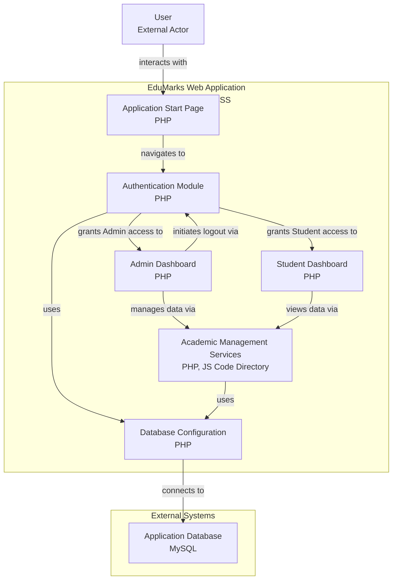

```mermaid
graph TD

    1499["User<br>External Actor"]
    subgraph 1490["External Systems"]
        1498["Application Database<br>MySQL"]
    end
    subgraph 1491["EduMarks Web Application<br>PHP, MySQL, JS, CSS"]
        1492["Application Start Page<br>PHP"]
        1493["Authentication Module<br>PHP"]
        1494["Database Configuration<br>PHP"]
        1495["Admin Dashboard<br>PHP"]
        1496["Student Dashboard<br>PHP"]
        1497["Academic Management Services<br>PHP, JS Code Directory"]
        %% Edges at this level (grouped by source)
        1492["Application Start Page<br>PHP"] -->|navigates to| 1493["Authentication Module<br>PHP"]
        1495["Admin Dashboard<br>PHP"] -->|initiates logout via| 1493["Authentication Module<br>PHP"]
        1495["Admin Dashboard<br>PHP"] -->|manages data via| 1497["Academic Management Services<br>PHP, JS Code Directory"]
        1493["Authentication Module<br>PHP"] -->|uses| 1494["Database Configuration<br>PHP"]
        1493["Authentication Module<br>PHP"] -->|grants Admin access to| 1495["Admin Dashboard<br>PHP"]
        1493["Authentication Module<br>PHP"] -->|grants Student access to| 1496["Student Dashboard<br>PHP"]
        1497["Academic Management Services<br>PHP, JS Code Directory"] -->|uses| 1494["Database Configuration<br>PHP"]
        1496["Student Dashboard<br>PHP"] -->|views data via| 1497["Academic Management Services<br>PHP, JS Code Directory"]
    end
    %% Edges at this level (grouped by source)
    1499["User<br>External Actor"] -->|interacts with| 1492["Application Start Page<br>PHP"]
    1494["Database Configuration<br>PHP"] -->|connects to| 1498["Application Database<br>MySQL"]

```
