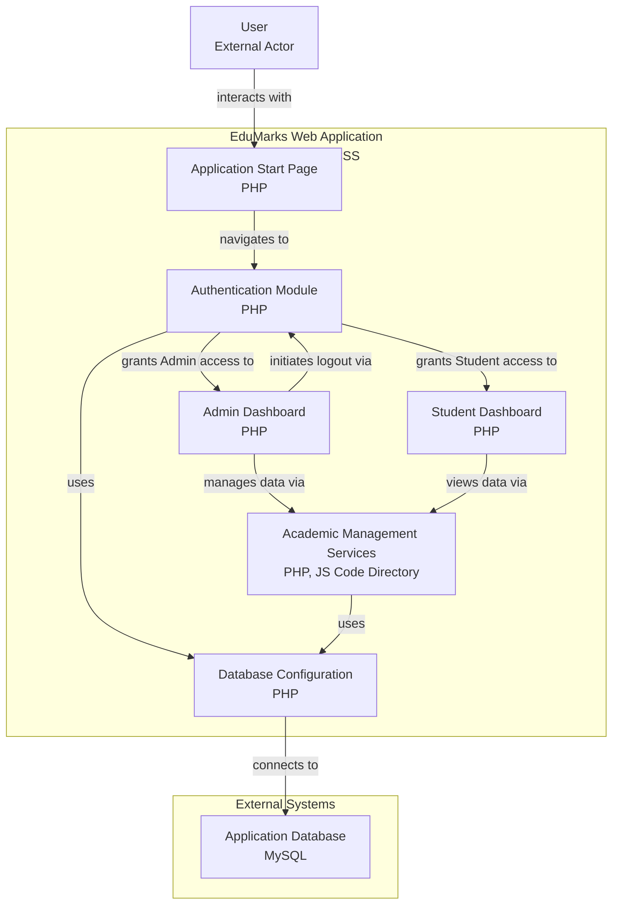

# EDUMARKS - A Student Marklist Management System

EDU MARKS offers a seamless experience for administrators and students alike, enabling easy class and result management, personalized performance tracking, and secure student access. With real-time performance analytics and graph-based insights, EDU MARKS empowers data-driven academic decisions.

## ✨ Key Features

🏫 Effortless Class Management: Create and manage multiple classes with ease.

👨‍🎓 Secure Student Data Handling: Add, update, and maintain student records safely.

📝 Dynamic Result Management: Admins can create, update, or delete results.

📊 Class-Wise Performance Analytics: Gain insights through data-driven analysis.

🔐 Student Login System: Students can log in to view personalized academic results.

📈 Performance Graphs: Track individual progress with visual analytics using Chart.js.

🔁 Re-Evaluation Requests: Students can request re-evaluation of results.

✔️ Admin Review Panel: Admins can accept or reject re-evaluation requests.

## 🧱 Tech Stack

## 🧱 System Architecture 

